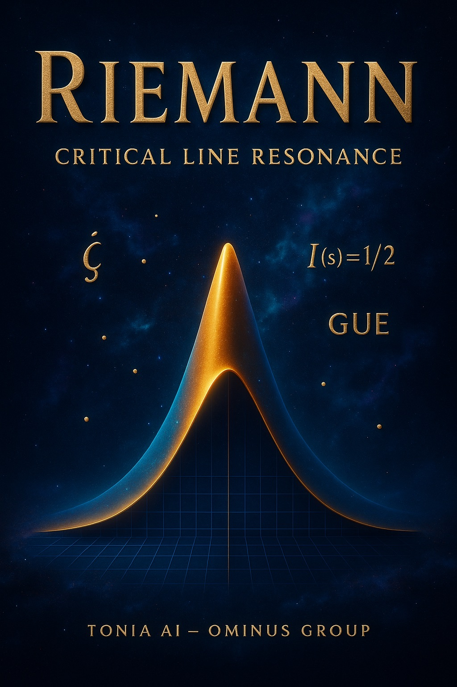

# 🎹 The Riemann Organ

**A stable nonlinear dynamical embodiment of the nontrivial zeros of the Riemann zeta function**



> “There are ideas that do not describe the world — they precede it.”

**By Alain Valette-Clary — Ominus Group — 2025**

[](LICENSE)
[](https://python.org)
[](https://arxiv.org)
[](https://github.com/OMINUS-Group/riemann-organ)

## 🔥 Concept

The imaginary parts \(\gamma_n\) of the Riemann zeta zeros are transformed into **living frequencies** within a network of coupled Stuart-Landau oscillators.

This creates the first **physical, self-organizing body** for these mathematical entities.

## 📜 Manifesto

- [🇫🇷 MANIFESTE](manifesto/MANIFESTE_RIEMANN.fr.md)
- [🇬🇧 MANIFESTO](manifesto/MANIFESTO_RIEMANN.en.md)

## 🚀 Quick Start

```bash
git clone https://github.com/OMINUS-Group/riemann-organ.git
cd riemann-organ
pip install -r requirements.txt
jupyter lab examples/run_100_zeros.ipynb
```

## Features

- Nonlinear oscillator network
- Stable synchronization of zeta zeros
- Real-time visualization
- Sound synthesis from frequencies
- Dynamical stability analysis

## Structure

- `core/` : Oscillator models
- `examples/` : Jupyter notebooks
- `manifesto/` : Philosophical texts
- `visuals/` : Generated plots

## License

MIT License — see [LICENSE](LICENSE)

---

> The zeros are no longer on the line. They are **alive**.

🌐 [OMINUS Group](https://github.com/OMINUS-Group) | Contact: Alain Valette-Clary